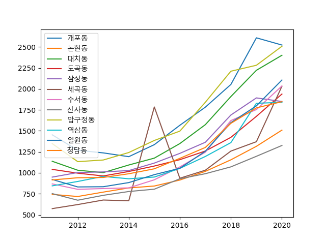

사용 언어 : Python3<br>

분석 목적 : 연도별 강남구 동마다 평균 평당 아파트가격을 측정해 현재(2021)이후의 가격을 회귀분석을 통해 예측한다.



code
```python
import pandas as pd
import matplotlib.pyplot as plt
import numpy as np

apt_df = pd.read_csv('../resources/아파트_실거래가_2011-2020.csv',
                     encoding='cp949')

apt_df.rename(columns={'연도':'year',
                       '행정구역(동)':'area',
                       '1㎡당 가격':'price'},
                inplace=True)

print(type(apt_df['price'][118]))

condition = apt_df['area'] == '개포동'

xValues = apt_df['year'].unique()
yValues = apt_df[condition]['price']
areaList = apt_df['area'].unique()
for areaValue in areaList:
    condition = apt_df['area'] == areaValue
    yValues = apt_df[condition]['price']


    plt.plot(xValues, yValues, label = areaValue)
    plt.legend()
    plt.rc('font', family='Malgun Gothic')
plt.show()
```

이를통해 원하는 연도와 동 입력시 가격을 예측하는 모듈을 만들었다.

```python

def apt_module(area, year):
    import pandas as pd
    import matplotlib.pyplot as plt
    import numpy as np
    from sklearn.model_selection import train_test_split
    from sklearn.linear_model import LinearRegression

    apt_df = pd.read_csv('C:/Users/202-14/Documents/카카오톡 받은 파일/아파트_실거래가_2011-2020 (1).csv', index_col=False,
                         encoding='cp949', engine='python')

    apt_df.rename(columns={'연도': 'year',
                           '행정구역(동)': 'area',
                           '1㎡당 가격': 'price'},
                  inplace=True)
    # apt_df['price'] = apt_df['price'].map(lambda x :float(str(x).replace(',','')), na_action=None)
    apt_df['price'] = apt_df['price'].apply(lambda v: v.replace(',', ''))  # 정수형으로 바꾸기
    apt_df['price'] = apt_df['price'].astype('float64')  # float형으로 바꾸기
    apt_df['price'].apply(lambda v: v * 3.3)  # 3.3 곱해서 평당가격으로 변환
    print(apt_df)

    xValues = apt_df['year'].unique()  # x축 연도
    condition = apt_df['area'] == area
    yValue = apt_df[condition]['price'].to_numpy()

    train_input, test_input, train_target, test_target = train_test_split(xValues, yValue, random_state=40)

    train_input = train_input.reshape(-1, 1)
    test_input = test_input.reshape(-1, 1)

    train_poly = np.column_stack((train_input ** 2, train_input))
    test_poly = np.column_stack((test_input ** 2, test_input))
    print(f'train poly : {train_poly}')
    print(f'test_poly : {test_poly}')

    lr = LinearRegression()
    lr.fit(train_poly, train_target)
    lr_score = lr.score(test_poly, test_target)
    for k in range(2011, (year)+1):
        lr_predict = lr.predict([[k ** 2, k]])
        print(f'lr_predict : {lr_predict}')
    print(f'lr_score : {lr_score}')
    # print(f' lr_predict : {lr_predict}')

    print(f'lr.coef : {lr.coef_}')
    print(f'lr.intercept : {lr.intercept_}')

    point = np.arange(2011, (year)+1)
    # plt.scatter(train_input, train_target)
    plt.plot(point, lr.coef_[0] * point ** 2 + lr.coef_[1] * point + lr.intercept_)
    for i in range(2011,(year)+1):
        lr_predict = lr.predict([[i ** 2, i]])
        plt.scatter(i, lr_predict)
        print(i, lr_predict)

    plt.show()

if __name__ =="__main__":
    apt_module('청담동',2028)


```
